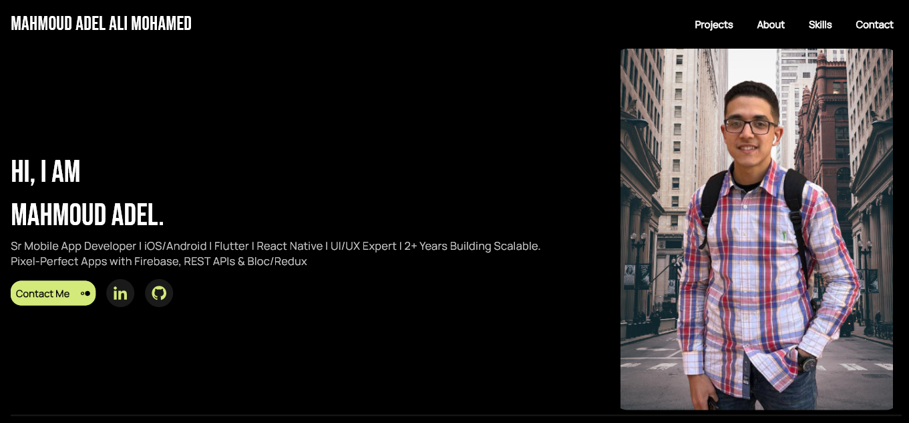
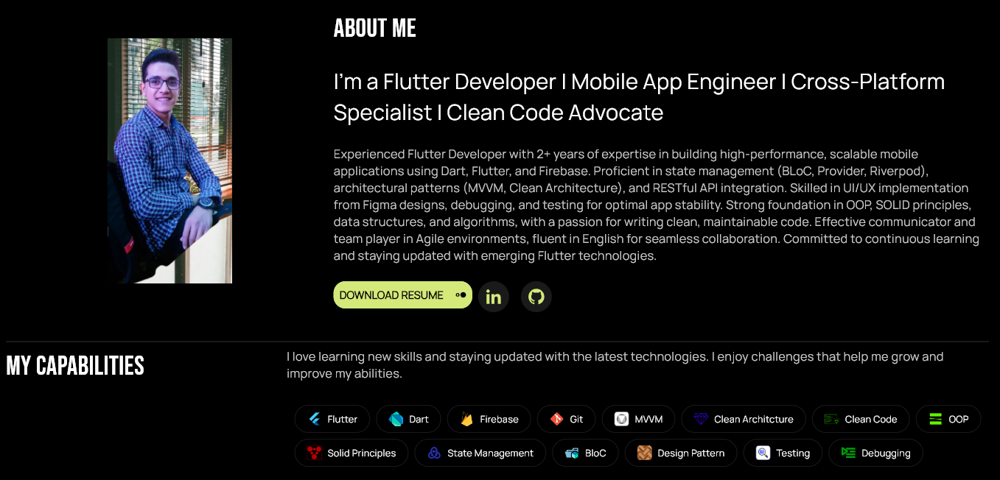
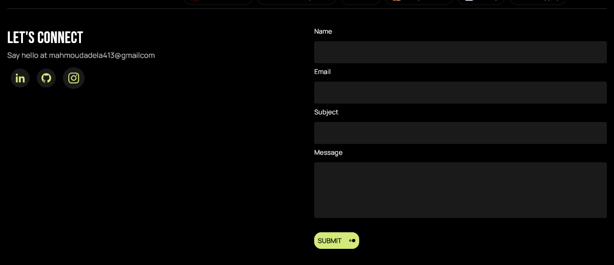
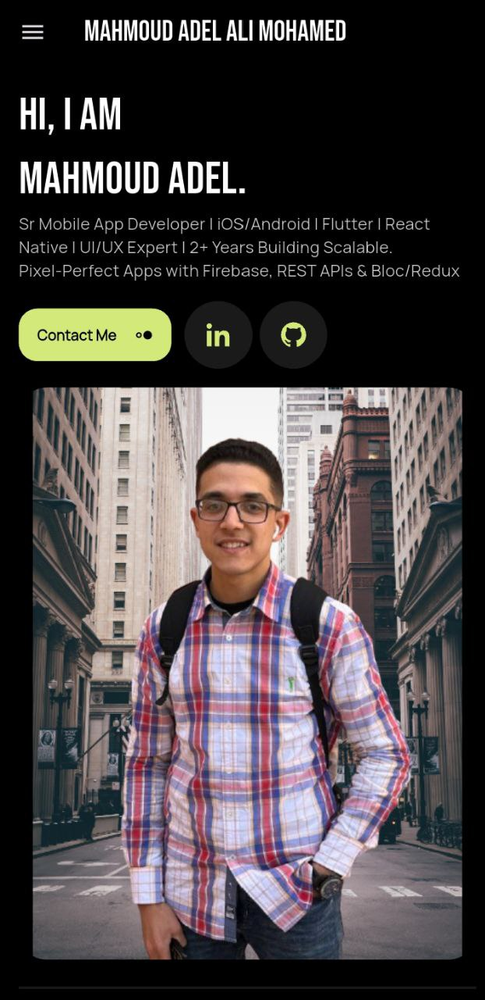
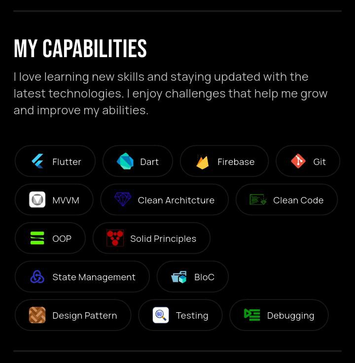
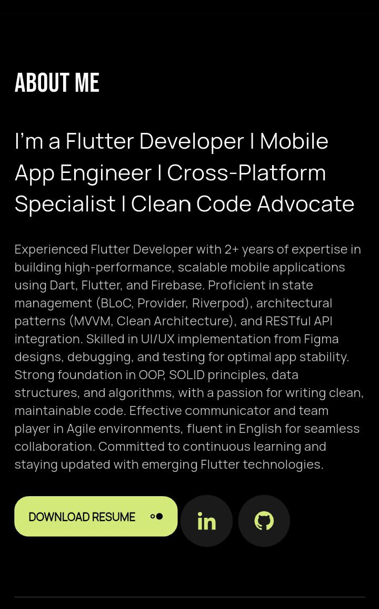
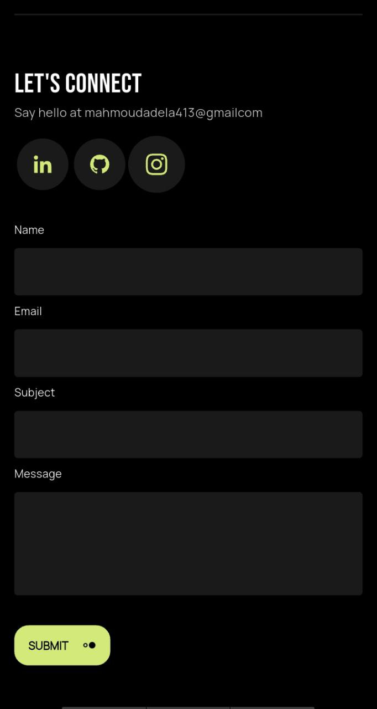

# 🚀 My Portfolio (Built with Flutter)

Welcome to my personal **Portfolio Website**, crafted using the powerful **Flutter framework**.  
The primary goal of this project is to **present my skills, personal background, and latest Flutter projects** in a clean, professional, and responsive format — accessible on both desktop and mobile devices.

> 🔥 This portfolio reflects who I am as a developer — my design choices, animations, state management skills, and use of APIs and tools.

---

## 🎯 Project Goals

- Display professional **personal branding** and development work
- Showcase a list of **projects** with interactive UI
- Provide easy ways for visitors to **connect** (email, social links)
- Implement real-world Flutter techniques like **state management**, **responsive design**, and **web deployment**
- Use **clean architecture** and **Flutter best practices**

---

## 📸 Preview

> Add actual screenshots to `assets/preview-desktop1.png`, `assets/preview-desktop2.png`, etc., and `assets/preview-mobile1.png`, `assets/preview-mobile2.png`, etc., before publishing.

### Desktop Preview

### Mobile Preview

---

## 🧰 Packages Used & Why

| Package            | Purpose                                                                 |
|--------------------|-------------------------------------------------------------------------|
| `flutter_bloc`     | For effective **state management** and **UI state separation**          |
| `bloc`             | Core BLoC pattern implementation used by `flutter_bloc`                 |
| `animate_do`       | Beautiful **pre-built animations** for widgets (fade, slide, bounce...) |
| `flutter_dotenv`   | Manage sensitive data like API keys using **`.env` files**              |
| `mailer`           | Send email messages from the app (used in **Contact Me** section)       |
| `flutter_svg`      | Load and render **SVG icons** like social logos or illustrations        |
| `url_launcher`     | Open external URLs (LinkedIn, GitHub, etc.) from buttons/links          |
| `cupertino_icons`  | Apple-style icons used throughout the design                            |

---

## 🖥️ Features

- ✅ Built with Flutter for **Web**
- ✅ 100% Responsive for **Mobile, Tablet, and Desktop**
- ✅ Custom animations with `animate_do`
- ✅ Clean and modular code using `flutter_bloc`
- ✅ Contact form with **email support** (via `mailer`)
- ✅ External links to **GitHub**, **LinkedIn**, etc.
- ✅ SEO-friendly page with favicon, meta tags, and manifest

---

## 🎨 UI Design Source

This portfolio is based on a developer-focused UI kit from Figma:

🔗 [View the Figma Design](https://www.figma.com/design/nr1tqLyTv12dw3XQns6wDr/Portfolio-for-Developers--Community-?node-id=0-1&t=xjQHgFdZg8JS3BlJ-1)

